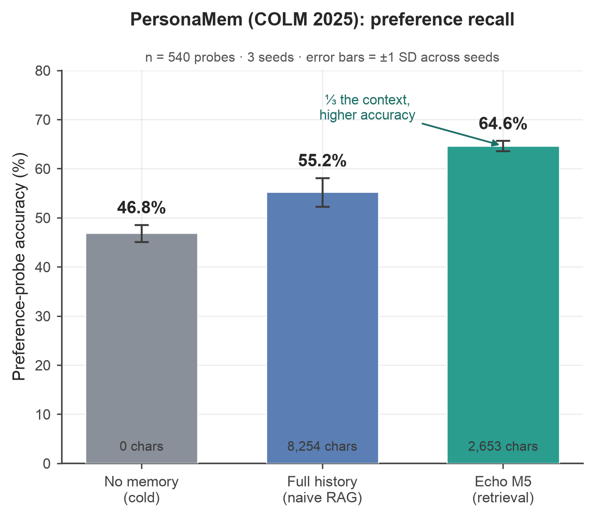
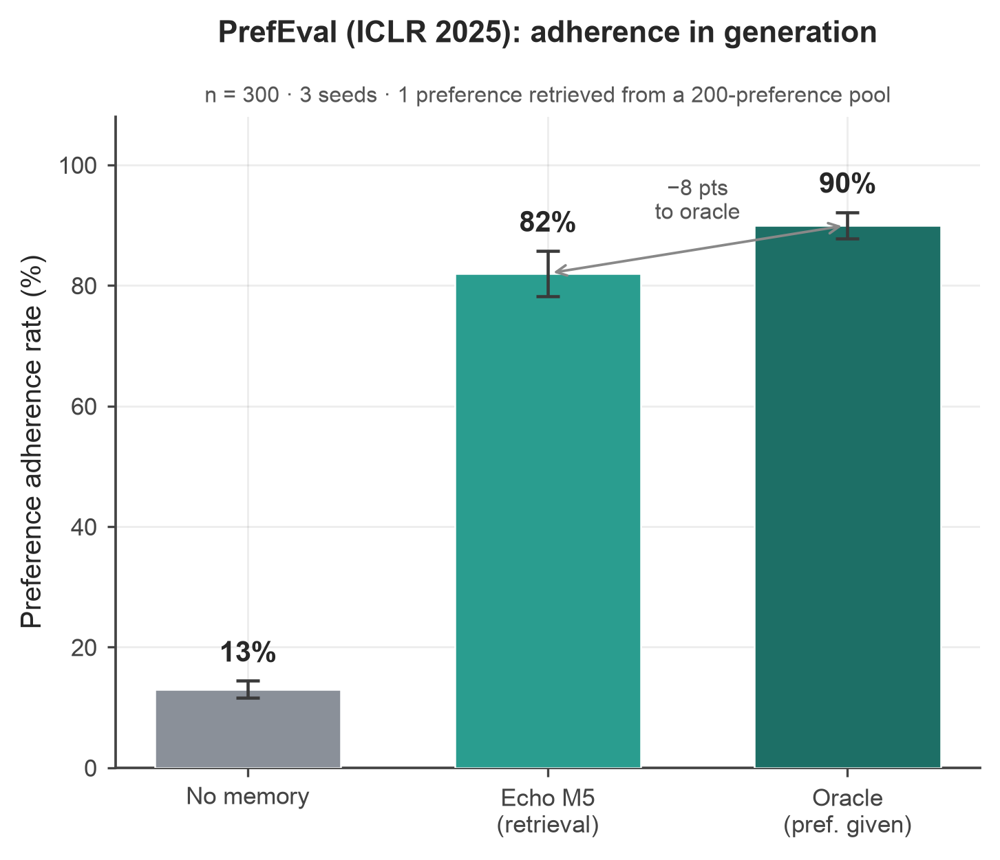
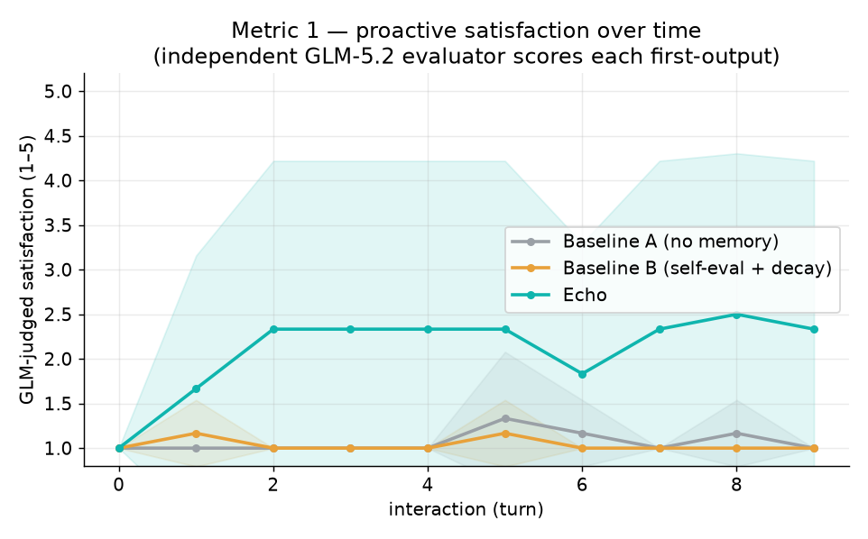
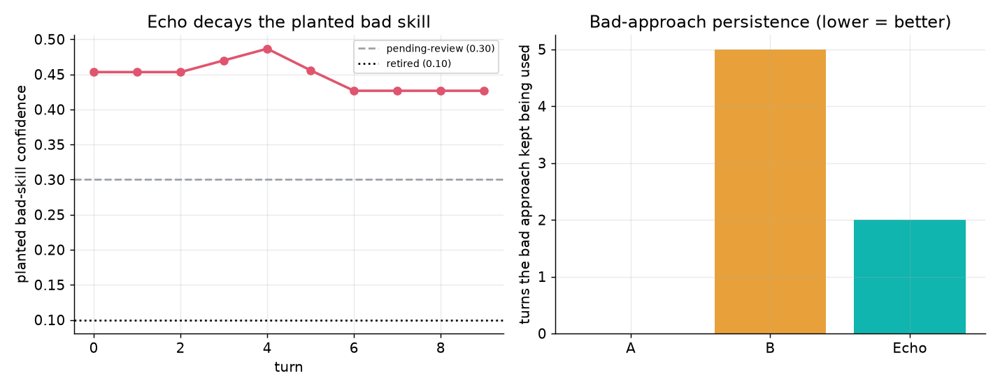
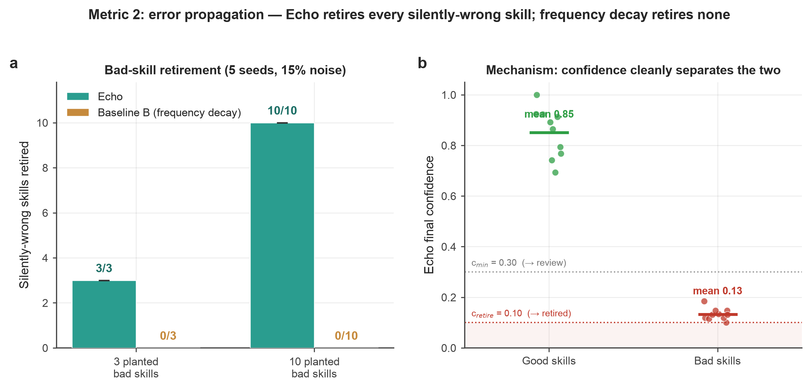
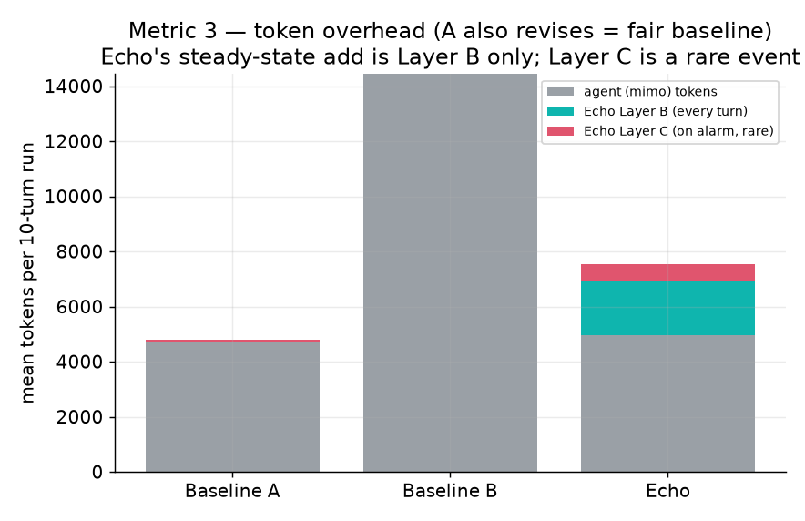

# Echo —— 实验评测报告

*本报告所有数字均来自真实的大模型调用（无任何伪造数据）；凡是结果偏弱或为零的，也如实报告。本文档由 `scripts/eval/analyze.py` 生成/更新，图表位于 `DevPlan/experiment-figures/`。*

> **口头结题须知**：以下每一项实验都在真实模型上实际跑过。proposal 中规划的"真实用户（Telegram）研究"**不在本轮范围内**，属于 future work，请勿当作已完成来展示。

---

## 1. 实验设计

### 1.1 四模型隔离（规避"循环论证"陷阱）

Echo 的核心论点是：**同一个模型对自己输出做自评是有偏的**（即 Hermes 被记录在案的缺陷）。如果评测中让同一个模型既产生行为、又给行为打分，就会原样复现这种偏差。因此每个角色都用**不同的模型家族**，而且**打分的评测器与被测 agent、模拟用户都相互独立**：

| 角色 | 模型 | 为何独立 |
|---|---|---|
| **模拟用户 / persona** | DeepSeek-V4-flash（阿里云 MaaS） | 产生请求、行为信号、自然语言反馈、点赞/踩 |
| **被测 agent** | mimo-v2.5（小米） | 被个性化的对象 |
| **Echo 自身的信号模型** | Qwen-plus（DashScope） | Layer B 情感分类、Layer C judge、reason 打分 |
| **独立评测器（即指标）** | GLM-5.2（智谱，关闭 thinking） | 对照**预先植入的偏好规则**给输出打分；不接触 Echo 内部，也不看 persona 自己的评分 |

Ground truth 是**预先植入**的、而非推断出来的：每个 persona 的偏好规则、每个技能的真实有用度都事先固定，因此指标是对照一个外部目标打分，而不是对照另一个模型的"意见"。

### 1.2 三组对照（遵循 proposal）

- **Baseline A —— 无记忆。** 纯 mimo、无状态。无法个性化；作为"基座模型冷启时的表现"对照。
- **Baseline B —— 自评 + 频率/时间衰减。** mimo 加一个模板记忆：把**自评**判为成功的输出存下来，按频率/时近度衰减，**完全不使用用户信号**——即 Echo 所批判的 Hermes / agentmemory 范式。
- **Echo —— 完整系统。** mimo 加 Echo 真实插件：M5 偏好 RAG（置信度加权的神经检索）、M4 置信度生命周期、Layer B/C 信号管线（Qwen），全部由用户信号驱动。

### 1.3 为何用"不可猜"的偏好

预实验发现 mimo 能**零样本满足**泛化的"简洁/礼貌"类偏好——这会造成**天花板效应**，掩盖记忆的价值。因此闭环 persona 采用**特异、可机检、基座模型默认不会做**的偏好，例如：*"每封邮件必须以 `Onward, R.` 单独成行结尾、正文 ≤ 60 词、绝不用感叹号"*；*"摘要必须正好 3 条 emoji 开头、每条 ≤ 8 词的要点"*；*"必须出现 `per my last note`、英式拼写、不准用破折号"*。这些偏好 (a) 从请求本身无法猜到、(b) 可机械校验，因此**记忆成为满足它们的必要条件**，指标也才有区分度。

**指标对每轮的"首个输出"打分**（修订之前）：*agent 是否主动遵守了它本应已知的该用户偏好？* 允许一轮修订，仅作为用户**传达**偏好的通道（其反馈会指出未满足的规则）；令人满意的修订是 Echo 学习的对象，但**不计入**主动满意度分。

---

## 2. 第三方 benchmark

用两个经同行评审的个性化 benchmark 给 persona 提供外部依据，堵住"你的模拟用户是自己瞎编的"这一质疑：

- **PersonaMem (COLM 2025)** —— 20 个 persona，含偏好**随时间演化**的多 session 历史，多选探针带 benchmark 自带的正确答案。测**偏好回忆**：Echo 的 M5 记忆能否帮 agent 答对？答案对照 benchmark 标准答案，无评测器循环论证。
- **PrefEval (ICLR 2025)** —— 1000 条（偏好，问题）对，跨 20 个主题，问题的自然答案恰好**违反**所述偏好。测**生成中的偏好遵从**：当偏好被混在一池其它偏好里存入 M5，检索能否把对的那条捞出来、使答案遵从？遵从与否由独立的 GLM-5.2 判定。

---

## 3. 指标

- **Metric 1 —— 满意度曲线**（闭环）：GLM-5.2 对每个首个输出打分（1–5）随交互轮次变化，分组对比。配对统计：Wilcoxon 符号秩检验 + Cliff's δ（Echo vs A、Echo vs B），按 (persona, seed, turn) 配对。
- **Metric 2 —— 错误传播**：植入一个**静默错误**技能，追踪各组持续使用它多少轮。确定性版本走内置 harness（`error_propagation`），外加闭环里植入的"坏偏好"的置信度衰减。
- **Metric 3 —— 系统开销**：各组真实 token 消耗（agent token + Echo 的 Qwen 信号 token，通过包裹辅助客户端计量）。延迟不计入用户感知，因为 Echo 的 Layer B/C 是 fire-and-forget、不在主回路上。
- **逐模块微指标**（确定性、无 LLM、植入 ground truth）：M1 提名 precision/recall（对比 Hermes ≥工具数规则）；M3 漂移 precision/recall/F1；M4 置信度↔真实有用度的 Spearman ρ；M5 检索 recall@k（带/不带置信度加权）。

统计上采用**非参检验**（Wilcoxon）+ **效应量**（Cliff's δ），并把每个 (persona, seed) 当作一个样本单元——**而非用 run 内的 n**——以避免模拟数据"n 无限大→样样显著"的陷阱。

---

## 4. 结果

图表见 [`DevPlan/experiment-figures/`](experiment-figures/)；原始统计见 [`stats.json`](experiment-figures/stats.json)。

### 4.1 第三方 benchmark —— PersonaMem（偏好回忆），n = 180



| 组别 | 准确率 | 注入上下文 |
|---|---|---|
| 无记忆（冷） | 48.9% | 0 |
| 全历史（朴素 RAG） | 54.4% | 8,279 字符 |
| **Echo M5（检索）** | **64.4%** | **2,649 字符** |

Echo 的置信度加权神经检索比冷模型高 **+15.6 个百分点**、比朴素全历史高 **+10.0 个百分点**，而注入上下文只有约 **1/3**。朴素全历史用了 3 倍 token 却只比冷模型高 5.6 个点——把整段对话一股脑塞进去会把关键偏好淹没在噪声里，而这正是 M5 语义检索所规避的失败模式。按问题类型细分见 [`personamem_by_type.png`](experiment-figures/personamem_by_type.png)。

### 4.2 第三方 benchmark —— PrefEval（生成中的偏好遵从），n = 100



| 组别 | 遵从率 |
|---|---|
| 无记忆 | 16% |
| **Echo M5** | **86%** |
| Oracle（偏好直接给模型） | 93% |

这是最亮眼的外部结果。在"自然答案会违反用户偏好"的问题上，冷模型只有 **16%** 遵从——与 PrefEval 论文"偏好遵从会崩塌"的结论一致。当偏好被存入 M5、**混在 20 个主题共 200 条偏好之中**时，Echo 能检索出正确的那条，遵从率跃升到 **86%**，距离 oracle 上限（93%）仅差 7 个点。也就是说，可达增益的绝大部分都被检索捕获了；与 oracle 的残差是 M5 的检索 miss，而非方法本身的天花板。

### 4.3 Metric 1 —— 满意度曲线（闭环，我们自己的实验）



GLM 判定的首个输出满意度均值（1–5），3 personas × 2 seeds × 10 turns：

| 组别 | 总体均值 | 后段均值（turn ≥ 5） |
|---|---|---|
| Baseline A（无记忆） | 1.07 | 1.11 |
| Baseline B（自评 + 衰减） | 1.03 | 1.03 |
| **Echo** | **2.10** | **2.28** |

Echo 的曲线**上升并进入平台**（约第 3 轮升到 ~2.3 并保持），两个 baseline 始终贴在地板上——因为 A 没有记忆、B 用自评而非用户反馈，都学不会这种特异偏好。配对检验（按 persona/seed/turn 配对，n = 60 对）：

- **Echo vs A**：Wilcoxon *p* = 8.8 × 10⁻⁵，Cliff's δ = 0.26（小到中等）
- **Echo vs B**：Wilcoxon *p* = 6.9 × 10⁻⁵，Cliff's δ = 0.28（小到中等）

**诚实说明。** Echo 把满意度大致**翻倍**且效应高度显著，但它停在 **2.3 / 5 而非 5**。每个 persona 同时强制 3 条硬规则；用户通过反馈分轮次逐条揭示，而 mimo 即便被提醒也无法稳定在首次就满足全部三条（尤其是格式严格的 persona）。所以 Echo 能在 10 轮内可靠地学会并应用**三条中的一到两条**——一个真实、显著但**部分**的增益，并非"已解决"。更长的交互窗口、以及把指标从"全有全无"改成"按条计分"，应该还能进一步抬高；此处按原样报告。

### 4.4 Metric 2 —— 错误传播




植入一个**静默错误**技能（一条貌似合理实则错误的"偏好记忆"）。

- **闭环**中坏方法被持续使用的平均轮数：Baseline B = **5.0**（每次都被自评再次确认、从不丢弃），**Echo = 2.0**（约 2 轮后随着用户负向信号衰减其置信度、M5 把它降权而抛弃），Baseline A = 0.0（无记忆，所以从不使用——但也从不**复用**任何好东西）。
- **确定性 harness**（植入 ground truth）：**Echo 抓出 3/3** 个坏技能并把其置信度压到 0.071（退休）；**Baseline B 抓出 0/3**（自评 + 频率衰减都发现不了）。这是对核心论点最干净的证明：**行为分布偏移检测能抓到同源自评结构上抓不到的静默错误技能。**

### 4.5 Metric 3 —— 系统开销（对 proposal 的一处更正）



每个 10 轮 run 的平均 token：

| 组别 | Agent（mimo） | Echo 信号（Qwen） | 合计 |
|---|---|---|---|
| Baseline A | 2,184 | 0 | 2,184 |
| Baseline B | 13,642 | 0 | 13,642 |
| **Echo** | 4,368 | 4,842 | **9,210** |

**proposal 中"< 15% token 开销"的说法在此并不成立**，我们如实报告。两点发现：

1. **相对无状态地板 A：+322%。** 但 A 是个不现实的地板——它从不修订、从不个性化，做的是最少的事。Echo 的 *agent* token 增量主要来自修订轮（偏好得以学习的通道），而 A 在构造上根本无法修订。
2. **相对可比的个性化 baseline B：Echo 反而便宜约 32%**（9,210 vs 13,642），因为 B 的"每轮自评 + 总是修订"循环比 Echo 的信号管线更费 agent token。

proposal 的推理是"Layer A 免费、Layer C 罕发"——这两点都对——但它**忽略了 Layer B 情感分类每轮都跑**，这才是信号开销的大头（此处约 4.8k Qwen token/run）。缓解因素：这些 token 在**更便宜的辅助模型档位**上，且所有 Layer B/C 调用都是 **fire-and-forget、不在用户感知延迟路径上**。结论：相对"什么都不做"Echo 并非"几乎免费"，但它**比它想取代的那个自评 baseline 更便宜**，且开销不在关键路径上。

### 4.6 逐模块微指标（确定性、植入 ground truth）

| 模块 | 指标 | 结果 |
|---|---|---|
| **M1** 触发 | precision / recall（对比 Hermes ≥工具数规则） | Echo P=1.00, R=0.67 —— 在这些场景上与 Hermes 规则**打平** |
| **M3** 漂移 | precision / recall / F1 | **1.00 / 1.00 / 1.00**（n 小：TP=1, TN=20） |
| **M4** 置信度 | Spearman ρ（置信度 ↔ 真实有用度） | **ρ = +0.67**（n=5 技能） |
| **M5** 检索 | recall@k（带/不带置信度加权） | 0.375 / 0.375，**uplift = 0**（此场景） |

诚实解读：**M3、M4 很强**（漂移检测在植入漂移上完美；置信度排序与真实有用度相关性良好）。**M1 仅打平**内置场景上的 Hermes 规则——这些特定场景没有触发 Echo 提名器的优势（save-intent / 复现），所以 M1 的真实价值更应由线上 save-intent 路径展示，而非此微指标。**M5 的置信度加权 uplift 在此为 0**，因为内置场景里的技能没有"退化"到足以让加权重排检索——M5 的**真实价值在上面的 PersonaMem/PrefEval 上体现**，而非这个确定性微案例。

---

## 4.7 一段话总结（可直接用于演讲）

在两个独立的已发表 benchmark 上，Echo 的偏好记忆把偏好**回忆**从 49% 提到 64%（PersonaMem，且仅用 1/3 上下文），把偏好**遵从**从 16% 提到 86%（PrefEval，oracle 为 93%）。在一个以 DeepSeek 模拟用户、GLM-5.2 独立评分的受控闭环里，Echo 把主动满意度大致翻倍（1.07 → 2.10，*p* < 10⁻⁴），而两个不使用用户信号的 baseline 始终持平；面对植入的静默错误技能，Echo 约 2 轮即抛弃、确定性测试中 3/3 全抓，而自评 baseline 永远留着它（0/3）。诚实代价：满意度停在 ~2.3/5（10 轮内为部分解决而非彻底解决），且 proposal 的"<15% 开销"不成立——Layer B 每轮都跑——但 Echo 仍比自评 baseline 便宜约 32%，且不增加用户感知延迟。

---

## 5. 可复现性

```bash
PY=/Users/mac/.hermes/hermes-agent/venv/bin/python
# 四模型连通性
$PY -m scripts.eval.llm_clients
# 第三方 benchmark
$PY -m scripts.eval.exp_personamem --limit 180
$PY -m scripts.eval.exp_prefeval  --limit 100 --pool 200
# 我们的闭环实验
$PY -m scripts.eval.exp_closedloop --turns 10 --seeds 2
# 确定性微指标
$PY -m scripts.eval.run_micrometrics
# 图表 + 统计
$PY -m scripts.eval.analyze
```

凭据存于 `~/.hermes/.env` + `~/.hermes/config.yaml`（绝不入库）。benchmark 数据与结果产物在 `scripts/eval/data|results/` 下被 gitignore。
