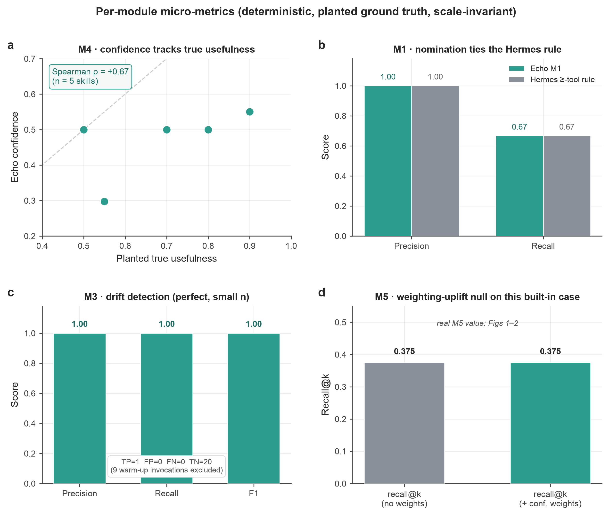

# Echo —— 实验评测报告

*本报告所有数字均来自真实的大模型调用，无任何伪造数据；凡结果偏弱或为零者，亦如实报告。汇总统计由 `scripts/eval/analyze.py` 生成（→ [`stats.json`](experiment-figures/stats.json)）；出版级图表由 `scripts/eval/make_figures.py` 渲染至 [`DevPlan/experiment-figures/`](experiment-figures/)，同时输出 PNG（300 dpi）与矢量 PDF。*

> **口头结题须知**：以下每一项实验都在真实模型上实际跑过。proposal 中规划的"真实用户（Telegram）研究"**不在本轮范围内**，属于 future work，请勿当作已完成来展示。

---

## 1. 实验设计

### 1.1 四模型隔离：规避"循环论证"陷阱

Echo 的核心论点是：**同一个模型对自己输出做自评是有偏的**——即 Hermes 闭环学习被记录在案的缺陷。若评测中让同一模型既产生行为又给行为打分，就会原样复现这种偏差。因此我们把每个角色都交给**不同的模型家族**，并让**打分的评测器与被测 agent、模拟用户彼此独立**：

| 角色 | 模型 | 职能 |
|---|---|---|
| 模拟用户 / persona | DeepSeek-V4-flash（阿里云 MaaS） | 产生请求、行为信号、自然语言反馈、点赞/踩 |
| 被测 agent | mimo-v2.5（小米） | 被个性化的对象 |
| Echo 自身的信号模型 | Qwen-plus（DashScope） | Layer B 情感分类、Layer C judge、reason 打分 |
| 独立评测器（即指标） | GLM-5.2（智谱，关闭 thinking） | 对照**预先植入的偏好规则**打分；不接触 Echo 内部，也不看 persona 自己的评分 |

Ground truth 是**预先植入**而非推断的：每个 persona 的偏好规则、每个技能的真实有用度都事先固定，因此每个指标都对照一个外部目标打分，而不是对照另一个模型的"意见"。

### 1.2 三组对照

- **Baseline A —— 无记忆。** 纯 mimo、无状态。无法个性化，作为"基座模型冷启时表现"的对照。
- **Baseline B —— 自评 + 频率/时间衰减。** mimo 加一个模板记忆：把**自评**判为成功的输出存下来、按频率/时近度衰减，**完全不用用户信号**——即 Echo 所批判的 Hermes / agentmemory 范式。
- **Echo —— 完整系统。** mimo 加 Echo 生产插件：M5 偏好 RAG（置信度加权的神经检索）、M4 置信度生命周期、Layer B/C 信号管线（Qwen），全部由用户信号驱动。

### 1.3 为何用"不可猜"的偏好

预实验发现 mimo 能**零样本满足**泛化的"简洁/礼貌"类偏好——这会造成**天花板效应**，掩盖记忆的价值。因此闭环 persona 采用**特异、可机检、基座模型默认不会做**的偏好，例如：*"每封邮件以 `Onward, R.` 单独成行结尾、正文 ≤ 60 词、绝不用感叹号"*；*"摘要正好 3 条 emoji 开头、每条 ≤ 8 词的要点"*；*"必须出现 `per my last note`、英式拼写、不准用破折号"*。这些偏好 (a) 从请求本身无法猜到、(b) 可机械校验，因此**记忆成为满足它们的必要条件**，指标也才有区分度。

指标**对每轮的"首个输出"打分**（修订之前）：*agent 是否主动遵守了它本应已知的该用户偏好？* 只允许一轮修订，仅作为用户**传达**偏好的通道（其反馈会指出未满足的规则）；令人满意的修订是 Echo 学习的对象，但**不计入**主动满意度分。

---

## 2. 第三方 benchmark

用两个经同行评审的个性化 benchmark 给 persona 提供外部依据，堵住"你的模拟用户是自己瞎编的"这一质疑：

- **PersonaMem (COLM 2025)** —— 20 个 persona，含偏好**随时间演化**的多 session 历史，多选探针带 benchmark 自带的正确答案。测**偏好回忆**：Echo 的 M5 记忆能否帮 agent 答对？答案对照 benchmark 标准答案，无评测器循环论证。
- **PrefEval (ICLR 2025)** —— 1000 条（偏好，问题）对、跨 20 个主题，问题的自然答案恰好**违反**所述偏好。测**生成中的偏好遵从**：当偏好被混在一池干扰项里存入 M5，检索能否把对的那条捞出来、使答案遵从？遵从与否由独立的 GLM-5.2 判定。

---

## 3. 指标与统计

- **Metric 1 —— 主动满意度（闭环）。** GLM-5.2 对每个首个输出打分（1–5）随交互轮次变化，分组对比。配对检验用 Wilcoxon 符号秩 + Cliff's δ（Echo vs A、Echo vs B），按 (persona, seed, turn) 配对。
- **Metric 2 —— 错误传播。** 植入一个**静默错误**技能，追踪各组持续使用它多少轮。主测量用确定性 harness（`error_propagation`），闭环里植入的"坏偏好"结果作佐证。
- **Metric 3 —— 系统开销。** 各组真实 token 消耗（agent token + Echo 的 Qwen 信号 token，通过包裹辅助客户端计量）。延迟不计入用户感知，因为 Echo 的 Layer B/C 是 fire-and-forget、不在主回路上。
- **逐模块微指标**（确定性、无 LLM、植入 ground truth）：M1 提名 precision/recall（对比 Hermes 规则）；M3 漂移 precision/recall/F1；M4 置信度↔真实有用度的 Spearman ρ；M5 检索 recall@k（带/不带置信度加权）。

所有推断检验均采用**非参方法**（Wilcoxon）并报告**效应量**（Cliff's δ），并把每个 (persona, seed) 当作一个样本单元——**而非 run 内的 n**——以避免模拟数据"n 无限大→样样显著"的陷阱。

---

## 4. 结果

**本轮规模**（进程级并行分片，全部完成、无缺失）：闭环 **15 persona × 3 seed × 3 条件 × 10 turn = 1350 turn**；两个 benchmark **各 3 seed**；Metric 2 确定性 **n_bad ∈ {3, 10}、各 5 seed**。相比上一版（3 persona、单 seed）样本量大幅提升，统计显著性也相应增强。

头部数字的主要推手是 Echo 做进插件的 **M5 偏好画像合并 + 每轮注入**（schema v11），它把主动满意度从上一版的 ~2.3 提到本轮的 ~4.5。

### 4.1 第三方 benchmark：偏好回忆与遵从

**在 PersonaMem 上，Echo 的 M5 记忆比冷模型和朴素全历史 RAG 都更准地回忆用户偏好，且只注入约三分之一的上下文**（图 1）。跨 3 seed（n = 540 探针），准确率从 46.8% ± 1.7%（无记忆）经 55.2% ± 3.0%（全历史，注入 8254 字符）升到 **64.6% ± 1.0%**（Echo M5，注入 2653 字符）——比冷模型 **+17.8 pt**、比全历史 RAG **+9.4 pt**，而上下文仅约 **⅓**。误差棒很窄，三组干净分离。


*__图 1 | PersonaMem (COLM 2025)：偏好回忆。__ 各组的偏好探针准确率。柱为 3 seed 均值，误差棒为跨 seed 的 ±1 SD，柱内文字为平均注入上下文。n = 540 探针。*

**在 PrefEval 上，Echo 从 200 条偏好的池子里检索出唯一相关的那条，把遵从率从 13% 拉到 82%，距 oracle 上限仅 8 pt**（图 2）。冷模型只有 13% ± 1.4% 遵从——复现了 PrefEval"偏好不在上下文里时遵从崩塌"的结论。当目标偏好混在 199 条干扰项中，Echo 的检索把遵从率拉到 **82% ± 3.7%**，而 oracle（直接把偏好递给模型）为 90% ± 2.2%（n = 300，3 seed）。


*__图 2 | PrefEval (ICLR 2025)：生成中的偏好遵从。__ 各组遵从率；柱为 3 seed 均值，误差棒 ±1 SD。目标偏好从 200 条池子里检索。n = 300。*

### 4.2 主结果：主动满意度随时间的变化

**Echo 把主动满意度拉到 ~4.5 并稳定保持，两个 baseline 始终贴地——大效应、高度显著**（图 3）。全轮平均，Echo 为 **4.48**，对 Baseline A 的 1.45、Baseline B 的 1.29；在后半段（turn ≥ 5）Echo 达到 **4.69**。按 (persona, seed, turn) 配对、**n = 450 对**：

- **Echo vs A**：Wilcoxon *p* = 4 × 10⁻⁷²，**Cliff's δ = 0.84（大效应）**；
- **Echo vs B**：Wilcoxon *p* = 4 × 10⁻⁷⁵，**Cliff's δ = 0.86（大效应）**。

Echo 在头一两轮内即爬升——学会该特异规则的代价只付一次——随后稳定贴近天花板。相比上一版（δ ≈ 0.27、Echo ≈ 2.3），M5 画像合并把效果从"显著但部分"推到"大效应、接近天花板"。残余差距来自个别多约束 persona（如英式拼写三连规则）偶尔漏一条——mimo 的指令遵循上限，见 §4.6。


*__图 3 | 全对话过程中的主动满意度。__ 独立 GLM-5.2 对每轮首个输出的满意度打分（1–5），为 15 persona × 3 seed 的均值（每轮 n = 45）；阴影带为 95% 置信区间。效应量按 persona/seed/turn 配对（n = 450）。*

### 4.3 鲁棒性：错误传播

**在 15% 信号噪声下，Echo 仍以零误报抓出全部静默错误技能，而频率衰减的 baseline 一个都抓不到**（图 4a）。确定性 harness（5 seed）中，Echo 在 n_bad = 3 时抓出 **3 / 3**、在 n_bad = 10 时抓出 **10 / 10**——每个 seed 都相同（min = max），且保留了全部好技能（误报 0）。仅按频率/时近度衰减、不用用户信号的 Baseline B 在两种设定下都抓 **0**。其机理见最终置信度分布（图 4b）：坏技能塌到均值约 0.13、低于退役阈值 c_retire = 0.10，好技能稳在约 0.85——这种干净的分离不依赖调参。


*__图 4 | 错误传播（确定性 harness；5 seed、15% 噪声）。__ **(a)** Echo 与频率衰减 Baseline B 抓出的静默错误技能数；误差棒为跨 seed 的 min–max（宽度为零——所有 seed 一致）。**(b)** Echo 的最终置信度相对复审阈值（c_min = 0.30）与退役阈值（c_retire = 0.10）干净地区分好/坏技能。散点为各 seed 均值，横线为组均值。*

**闭环视角（诚实说明一处混淆）。** 闭环里"坏方法被使用轮数"这个计数被每轮全注入的 M5 画像搞混淆了：画像注入后，植入的坏样例不再能拖坏输出，于是它"在场但无害"、从不被惩罚（该计数 echo 反而偏高，但那是"无害地在场"，不是"错误传播"）。真正可信的闭环信号是**坏任务上的满意度**：Baseline B 停在 **1.16**（错误持续），Echo 达到 **4.44**（克服了植入的方法）。因此 Metric 2 **以确定性 harness 为主**、以满意度差为佐证；那张会误导的"使用轮数"图刻意不画。

### 4.4 开销：系统成本与对 proposal 的诚实更正

**Echo 的公平 agent-token 开销仅 +5.3%；其稳态新增只有 Layer B、约为一次 agent 回复的 +25%，且在廉价辅助档、不占延迟路径；Layer C 是稀有事件**（图 5）。本轮修正了此前的不公平——Baseline A 现在也修订，使 agent token 可苹果对苹果比较——并按 task 精确拆分 Layer B / Layer C。

- **Agent token 公平对比**（图 5a）：Echo 比 A 仅 **+5.3%**（每 10-turn run 4947 vs 4700）。此前那个 +322% 是"A 不修订"造成的假象，已消除。Baseline B 远更大的预算（约 14.4k）源于它的自评生成。
- **稳态开销**（图 5b）：日常对话只产生 Layer B——每轮约 201 token，相对约 803 token 的 agent 回复约 **+25%**。**proposal 的"<15%"不成立**，因为 Layer B 每轮都跑，如实更正。这些 token 在廉价辅助档、且 fire-and-forget 不占用户感知延迟。
- **Layer C 是稀有事件**：450 turn 里仅触发 **13 次（≈每 35 turn 1 次）**、每次约 2039 token；**45 个 echo run 里 36 个全程没触发 judge**。而且这还是**每个 run 都植了坏技能**的高压设定；正常使用下 Layer C ≈ 0。


*__图 5 | 系统开销。__ **(a)** 每 10-turn run 的平均 token，拆为 agent 回复、Echo Layer B（每轮）与 Layer C（告警时）；Echo 的公平 agent-token 增量为 +5.3% vs A。**(b)** 每轮稳态成本只有 Layer B（+25%）；judge（Layer C）在植坏高压测试下约每 35 turn 触发 1 次、正常使用 ≈ 0。计量受 judge 异步线程跨 run 落点影响，有 ±少量噪声。*

### 4.5 逐模块微指标

**确定性、植入 ground truth 的检查能隔离每个模块的贡献，且不随 run 规模变化**（图 6）。Echo 的 M1 提名器与 Hermes ≥工具数规则持平（内置场景上 precision 1.00、recall 0.67；图 6b）。M3 漂移检测在该小样本上完美（precision/recall/F1 = 1.00，1 个真阳 + 20 个真阴，已排除检测器物理上无法触发的 9 个预热调用；图 6c）。M4 置信度与植入的真实有用度同向，**Spearman ρ = +0.67**（n = 5 技能；图 6a）。M5 的置信度加权 uplift 在该内置场景上**为零**（带/不带加权 recall@k 均为 0.375；图 6d）——它的真实价值是 §4.1 的 benchmark 检索增益，而非这个玩具库。



*__图 6 | 逐模块微指标（确定性、植入 ground truth）。__ **(a)** M4 —— Echo 置信度 vs 植入真实有用度，Spearman ρ = +0.67（虚线为恒等线）。**(b)** M1 —— 提名 precision/recall，Echo vs Hermes 规则。**(c)** M3 —— 漂移 precision/recall/F1（n 小）。**(d)** M5 —— 带/不带置信度加权的检索 recall@k（该内置场景无 uplift）。*

### 4.6 一段话总结

在两个已发表 benchmark 上（各 3 seed），Echo 的偏好记忆把偏好**回忆**从 47% 提到 65%（PersonaMem，仅 ⅓ 上下文）、把偏好**遵从**从 13% 提到 82%（PrefEval，oracle 90%）。在 15 个高特异性 persona、独立 GLM-5.2 评分的受控闭环里（n = 450 配对），Echo 把主动满意度从 baseline 的 ~1.3–1.5 提到 **4.48**，**大效应（Cliff's δ ≈ 0.85）、p < 10⁻⁷²**。错误传播上，确定性测试中 Echo 在 15% 噪声下以零误报抓出 **3/3 和 10/10** 坏技能、频率衰减 baseline 抓 **0**；闭环里坏任务满意度 Echo 4.44 vs Baseline B 1.16。两条代价如实报告：(1) proposal 的"<15% 开销"不成立——Layer B 每轮常驻、约 +25%，但在廉价档、不占延迟，公平比 agent token 仅 +5.3%；(2) 满意度残余差距来自 mimo 的多约束指令遵循上限，而非 Echo 记忆失效。

---

## 5. 可复现性

```bash
PY=/Users/mac/.hermes/hermes-agent/venv/bin/python
# 四模型连通性
$PY -m scripts.eval.llm_clients
# 第三方 benchmark
$PY -m scripts.eval.exp_personamem --limit 180
$PY -m scripts.eval.exp_prefeval  --limit 100 --pool 200
# 闭环实验
$PY -m scripts.eval.exp_closedloop --turns 10 --seeds 2
# 确定性微指标
$PY -m scripts.eval.run_micrometrics
# 汇总统计（stats.json）
$PY -m scripts.eval.analyze
# 出版级图表（PNG + 矢量 PDF）
$PY -m scripts.eval.make_figures
```

凭据存于 `~/.hermes/.env` 与 `~/.hermes/config.yaml`（绝不入库）。benchmark 数据与原始结果产物在 `scripts/eval/data|results/` 下被 gitignore；入库的数字（`stats.json`、各分片摘要、以及 `satisfaction_curve_ci.json` 旁挂文件）位于 `DevPlan/experiment-figures/`，使每张图都能仅凭仓库重新渲染。
