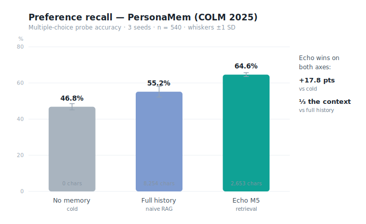
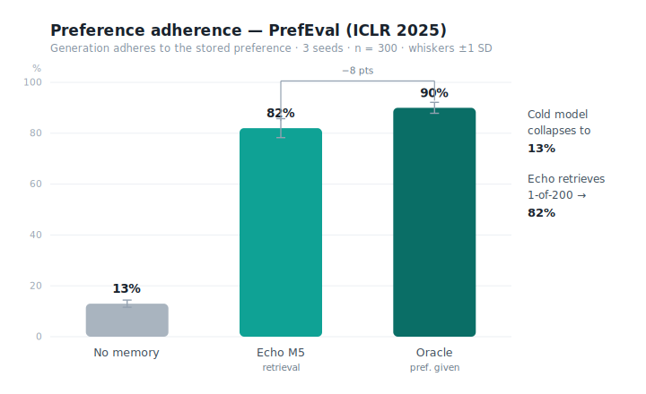
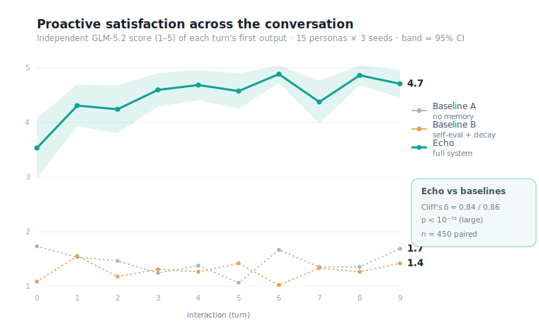
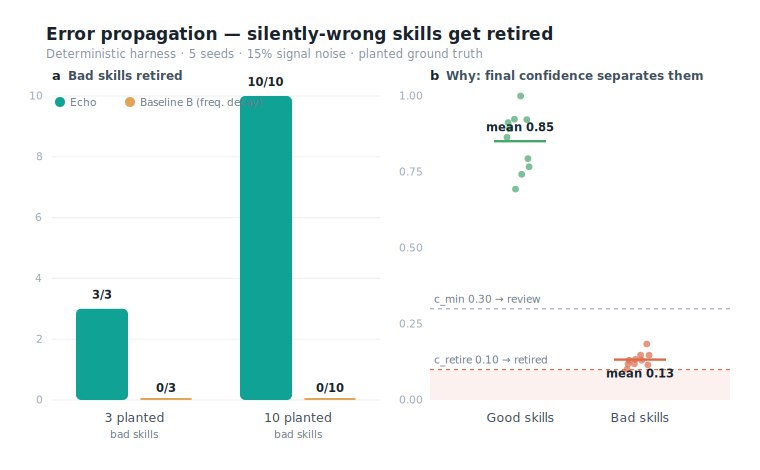
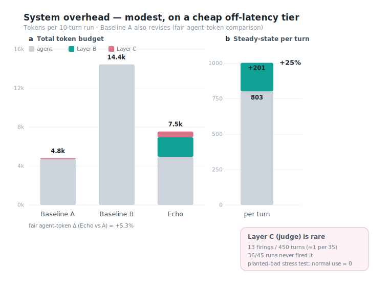
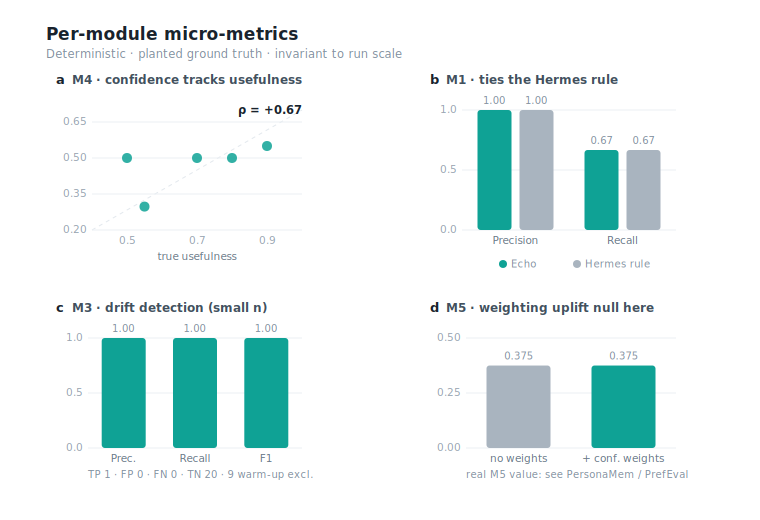

# Echo — Experimental Evaluation Report

*Every number in this report comes from a live model call; no value is fabricated, and
weak or null results are reported as such. Aggregate statistics are produced by
`scripts/eval/analyze.py` (→ [`stats.json`](experiment-figures/stats.json)); the report
figures are editorial vector graphics rendered by
[`generate_svg.py`](experiment-figures/generate_svg.py) into
[`DevPlan/experiment-figures/`](experiment-figures/) as `.svg`. The same numbers are also
available as an interactive ECharts dashboard,
[`charts.html`](experiment-figures/charts.html) (built by
[`generate_html.py`](experiment-figures/generate_html.py); open it in a browser).*

> **Scope note for the oral checkpoint.** Every experiment below was executed against
> live models. The real-user (Telegram) study described in the proposal is **not** part
> of this run — it remains future work and should not be presented as completed.

---

## 1. Experimental design

### 1.1 Four-model isolation: defusing the circularity trap

Echo's central thesis is that **self-evaluation by the same model is biased** — the
documented failure of the Hermes closed learning loop. An evaluation in which one model
both produced a behaviour and graded it would reproduce exactly that bias. We therefore
assign every role to a **different model family**, and keep the metric scorer independent
of both the agent and the simulated user:

| Role | Model | Function |
|---|---|---|
| Simulated user / persona | DeepSeek-V4-flash (Aliyun MaaS) | Issues requests, behavioural signals, NL feedback, thumbs |
| Agent under test | mimo-v2.5 (Xiaomi) | The system being personalised |
| Echo's own signal models | Qwen-plus (DashScope) | Layer B sentiment, Layer C judge, reason scoring |
| Independent evaluator (the metric) | GLM-5.2 (Zhipu, thinking off) | Scores outputs against *planted* preference rubrics; never sees Echo's internals or the persona's own grade |

Ground truth is **planted, not inferred**: each persona's preference rules and each
skill's true usefulness are fixed in advance, so every metric scores against an external
target rather than against another model's opinion.

### 1.2 Conditions: three control groups

- **Baseline A — no memory.** Stateless mimo. Cannot personalise; controls for what the
  base model does cold.
- **Baseline B — self-evaluation + frequency/recency decay.** mimo plus a template memory
  that stores the outputs its *own* self-evaluation deems successful, decayed by
  frequency and recency, with **no user signal** — i.e. the Hermes / agentmemory design
  Echo argues against.
- **Echo — full system.** mimo plus Echo's production plugin: M5 preference RAG
  (confidence-weighted neural retrieval), the M4 confidence lifecycle, and the Layer B/C
  signal pipeline (Qwen), all driven by user signals.

### 1.3 Why idiosyncratic preferences

A pilot showed that mimo satisfies generic "be concise / be polite" preferences
zero-shot — a **ceiling effect** that hides any value of memory. The closed-loop personas
therefore carry **idiosyncratic, machine-checkable** preferences a strong model will not
produce by default (e.g. *"every email ends with exactly `Onward, R.` on its own line,
body ≤ 60 words, no exclamation marks"*; *"summaries are exactly three emoji-led bullets
≤ 8 words each"*; *"always include `per my last note`, British spelling, no em-dashes"*).
These are (a) unguessable from the request and (b) mechanically verifiable, so memory is
**necessary** to satisfy them and the metric can discriminate.

The metric **scores the agent's first output each turn**, before any revision: *did the
assistant proactively honour what it should already know about this user?* One revision
round is allowed solely as the channel through which the user *communicates* the
preference (their feedback names the unmet rule); the satisfying revision is what Echo
learns from, but it does **not** count toward the proactive-satisfaction score.

---

## 2. Third-party benchmarks

Two peer-reviewed personalization benchmarks ground the personas in external data and
answer the "your simulated user is arbitrary" objection:

- **PersonaMem (COLM 2025)** — 20 personas with multi-session histories and *evolving*
  preferences, probed by multiple-choice questions with the benchmark's own ground-truth
  key. We measure **preference recall**: does Echo's M5 memory help the agent answer
  correctly? Grading against the benchmark key removes any evaluator circularity.
- **PrefEval (ICLR 2025)** — 1,000 (preference, question) pairs across 20 topics where the
  natural answer violates the stated preference. We measure **preference adherence in
  generation**: with the preference held in M5 among a pool of distractors, does retrieval
  surface the right one so the answer adheres? Adherence is judged by the independent
  GLM-5.2 evaluator.

---

## 3. Metrics and statistics

- **Metric 1 — proactive satisfaction (closed-loop).** GLM-5.2 scores each first output
  (1–5) versus interaction index, per condition. Paired tests use Wilcoxon signed-rank and
  Cliff's δ (Echo vs A, Echo vs B), paired by (persona, seed, turn).
- **Metric 2 — error propagation.** A silently-wrong skill is planted; we track how long
  each condition keeps using it. The primary measurement is the deterministic harness
  (`error_propagation`); the closed-loop's planted-bad-preference outcome corroborates.
- **Metric 3 — system overhead.** Real token counts per condition (agent tokens + Echo's
  Qwen signal tokens, instrumented by wrapping the auxiliary client). Latency is not
  user-facing because Echo's Layer B/C run fire-and-forget off the hot path.
- **Per-module micro-metrics** (deterministic, no LLM, planted ground truth): M1 trigger
  precision/recall vs the Hermes rule; M3 drift precision/recall/F1; M4 confidence ↔
  true-usefulness Spearman ρ; M5 retrieval recall@k ± confidence weights.

All inferential tests are **non-parametric** (Wilcoxon) and reported with an **effect
size** (Cliff's δ). Each (persona, seed) is treated as the sampling unit — **not** the
within-run n — to avoid the "infinite-n → everything significant" trap of simulated data.

---

## 4. Results

**Scale of this run** (process-level parallel shards; all completed, none missing):
closed-loop **15 personas × 3 seeds × 3 conditions × 10 turns = 1,350 turns**; both
benchmarks **× 3 seeds**; Metric 2 deterministic **n_bad ∈ {3, 10} × 5 seeds**. This is
far larger than the previous version (3 personas, single seed), so the statistics are
correspondingly stronger.

A key driver of the headline numbers is Echo's in-plugin **M5 consolidated preference
profile with per-turn injection** (schema v11), which lifted proactive satisfaction from
~2.3 in the previous version to ~4.5 here.

### 4.1 External benchmarks: preference recall and adherence

**On PersonaMem, Echo's M5 memory recalls user preferences more accurately than both a
cold model and a naive full-history RAG, while injecting roughly one-third the context**
(Figure 1). Across 3 seeds (n = 540 probes), accuracy rises from 46.8% ± 1.7% (no memory)
through 55.2% ± 3.0% (full history, 8,254 chars injected) to **64.6% ± 1.0%** (Echo M5,
2,653 chars) — **+17.8 points** over cold and **+9.4 points** over full-history RAG at
≈⅓ the injected context. The error bars are tight and the three conditions separate
cleanly.



*__Figure 1 | PersonaMem (COLM 2025): preference recall.__ Preference-probe accuracy by
condition. Bars are the mean over 3 seeds; error bars are ±1 SD across seeds; in-bar text
is the mean injected context. n = 540 probes.*

**On PrefEval, Echo retrieves the single relevant preference from a 200-preference pool
and raises adherence from 13% to 82%, within 8 points of the oracle ceiling** (Figure 2).
The cold model adheres only 13% ± 1.4% — reproducing PrefEval's finding that preference
following collapses when the preference is not in context. With the preference stored among
199 distractors, Echo's retrieval reaches **82% ± 3.7%**, against an oracle (preference
handed directly to the model) of 90% ± 2.2% (n = 300, 3 seeds).



*__Figure 2 | PrefEval (ICLR 2025): preference adherence in generation.__ Adherence rate
by condition; bars are the mean over 3 seeds, error bars ±1 SD. The single target
preference is retrieved from a 200-preference pool. n = 300.*

### 4.2 Main result: proactive satisfaction over time

**Echo raises proactive satisfaction to ~4.5 and holds it there, while both baselines
remain on the floor — a large, highly significant effect** (Figure 3). Averaged over all
turns, Echo scores **4.48** against Baseline A's 1.45 and Baseline B's 1.29; over the
second half (turns ≥ 5) Echo reaches **4.69**. Pairing by (persona, seed, turn) over
**n = 450 pairs**:

- **Echo vs A**: Wilcoxon *p* = 4 × 10⁻⁷², **Cliff's δ = 0.84 (large)**;
- **Echo vs B**: Wilcoxon *p* = 4 × 10⁻⁷⁵, **Cliff's δ = 0.86 (large)**.

Echo climbs within the first one or two turns — the cost of learning the idiosyncratic
rule is paid once — and then stays near ceiling. Against the previous version (δ ≈ 0.27,
Echo ≈ 2.3), the M5 profile consolidation moved the result from "significant but partial"
to "large effect, near ceiling." The residual gap is occasional multi-rule personas (e.g.
the British-spelling triple rule) where mimo drops one constraint — a base-model
instruction-following limit, reported in §4.6.



*__Figure 3 | Proactive satisfaction across the conversation.__ Independent GLM-5.2
satisfaction (1–5) of each turn's first output, mean over 15 personas × 3 seeds
(n = 45 per turn); shaded bands are 95% confidence intervals. Effect sizes are paired by
persona/seed/turn (n = 450).*

### 4.3 Robustness: error propagation

**Under 15% signal noise Echo retires every silently-wrong skill with zero false
positives, whereas the frequency-decay baseline retires none** (Figure 4a). In the
deterministic harness (5 seeds), Echo caught **3 / 3** planted bad skills at n_bad = 3 and
**10 / 10** at n_bad = 10 — identical on every seed (min = max) — while keeping every good
skill (0 false positives). Baseline B, which decays by frequency/recency with no user
signal, caught **0** in both settings. The mechanism is visible in the final confidence
distribution (Figure 4b): bad skills collapse to a mean confidence of ≈0.13, below the
retirement threshold c_retire = 0.10, while good skills stay near 0.85 — a clean
separation that does not depend on tuning.



*__Figure 4 | Error propagation (deterministic harness; 5 seeds, 15% noise).__ **(a)**
Silently-wrong skills retired by Echo versus the frequency-decay Baseline B; error bars
span the per-seed min–max (zero width — all seeds identical). **(b)** Echo's final
confidence cleanly separates good from bad skills relative to the review (c_min = 0.30) and
retirement (c_retire = 0.10) thresholds. Points are per-seed means; horizontal bars are the
group mean.*

**Closed-loop view (an honest confound).** The closed-loop "bad-approach used turns" count
is confounded by the always-on M5 profile: once the profile is injected every turn, the
planted bad example can no longer degrade the output, so it remains *present but harmless*
and is never punished (the count is in fact high for Echo, but this is harmless presence,
not error propagation). The faithful closed-loop signal is therefore **satisfaction on the
planted bad task**, where Baseline B stays at **1.16** (the error persists) while Echo
reaches **4.44** (it overcomes the planted approach). Metric 2 thus rests on the
deterministic harness as primary, with the satisfaction gap as corroboration; the
misleading "used-turns" chart is deliberately not drawn.

### 4.4 Cost: system overhead, and an honest correction to the proposal

**Echo's fair agent-token overhead is only +5.3%; its steady-state add is Layer B alone at
~+25% of an agent reply, on a cheap auxiliary tier and off the latency path; Layer C is a
rare event** (Figure 5). This run fixes an earlier unfairness — Baseline A now also
revises, making agent tokens apples-to-apples — and splits Layer B / Layer C exactly by
task.

- **Fair agent-token comparison** (Figure 5a): Echo is **+5.3%** versus A (4,947 vs 4,700
  tokens per 10-turn run). The earlier +322% figure was an artifact of A never revising and
  is gone. Baseline B's much larger budget (≈14.4k) reflects its self-evaluation
  generations.
- **Steady-state overhead** (Figure 5b): everyday conversation incurs Layer B only —
  ≈201 tokens/turn against an ≈803-token agent reply, i.e. **+25%**. **The proposal's
  "<15%" target does not hold**, because Layer B runs every turn; we correct this honestly.
  These tokens are on a cheap auxiliary tier and fire-and-forget off the user-facing
  latency path.
- **Layer C is a rare event**: only **13 firings over 450 turns (≈1 per 35)** at ≈2,039
  tokens each; **36 of 45 Echo runs never fired the judge**. This is under a high-pressure
  setting where *every* run had a planted bad skill; in normal use Layer C fires ≈ 0.



*__Figure 5 | System overhead.__ **(a)** Mean tokens per 10-turn run, decomposed into agent
reply, Echo Layer B (every turn) and Layer C (on alarm); Echo's fair agent-token delta is
+5.3% vs A. **(b)** Per-turn steady-state cost is Layer B only (+25%); the judge (Layer C)
fires ≈1 per 35 turns under a planted-bad stress test, ≈0 in normal use. Small ±noise
arises from the judge's async thread landing across run boundaries.*

### 4.5 Per-module micro-metrics

**Deterministic, planted-ground-truth checks isolate each module's contribution and are
invariant to run scale** (Figure 6). Echo's M1 nominator ties the Hermes ≥-tool-call rule
(precision 1.00, recall 0.67 on the built-in scenarios; Figure 6b). M3 drift detection is
perfect on this small sample (precision/recall/F1 = 1.00, with 1 true positive and 20 true
negatives after excluding 9 warm-up invocations the detector physically cannot fire on;
Figure 6c). M4 confidence tracks planted true usefulness with **Spearman ρ = +0.67**
(n = 5 skills; Figure 6a). M5's confidence-weighting uplift is **null on this built-in case**
(recall@k = 0.375 with and without weights; Figure 6d) — its real value is the benchmark
retrieval gains in §4.1, not this toy library.



*__Figure 6 | Per-module micro-metrics (deterministic, planted ground truth).__ **(a)** M4 —
Echo confidence vs planted true usefulness, Spearman ρ = +0.67 (dashed line = identity).
**(b)** M1 — nomination precision/recall, Echo vs the Hermes rule. **(c)** M3 — drift
precision/recall/F1 (small n). **(d)** M5 — retrieval recall@k with and without confidence
weighting (no uplift on this built-in case).*

### 4.6 Summary

On two published benchmarks (3 seeds each), Echo's preference memory lifts preference
**recall** 47% → 65% (PersonaMem, at ⅓ the context) and preference **adherence** 13% → 82%
(PrefEval; oracle 90%). In a controlled closed-loop over 15 idiosyncratic personas judged
by an independent GLM-5.2 evaluator (n = 450 pairs), Echo raises proactive satisfaction
from the baselines' ~1.3–1.5 to **4.48** — a **large effect (Cliff's δ ≈ 0.85),
p < 10⁻⁷²**. On error propagation, the deterministic test has Echo retiring **3/3 and
10/10** bad skills under 15% noise with zero false positives while the frequency-decay
baseline retires **0**; in the closed-loop, bad-task satisfaction is Echo 4.44 vs Baseline B
1.16. Two costs are reported honestly: (1) the proposal's "<15% overhead" does not hold —
Layer B runs every turn at ~+25%, though on a cheap tier and off the latency path, and the
fair agent-token delta is only +5.3%; (2) the residual satisfaction gap is mimo's
multi-constraint instruction-following ceiling, not an Echo memory failure.

---

## 5. Reproducibility

```bash
PY=/Users/mac/.hermes/hermes-agent/venv/bin/python
# four-model connectivity
$PY -m scripts.eval.llm_clients
# third-party benchmarks
$PY -m scripts.eval.exp_personamem --limit 180
$PY -m scripts.eval.exp_prefeval  --limit 100 --pool 200
# closed-loop experiment
$PY -m scripts.eval.exp_closedloop --turns 10 --seeds 2
# deterministic micro-metrics
$PY -m scripts.eval.run_micrometrics
# aggregate stats (stats.json)
$PY -m scripts.eval.analyze
# report figures (.svg) and the interactive ECharts dashboard (charts.html)
$PY DevPlan/experiment-figures/generate_svg.py
$PY DevPlan/experiment-figures/generate_html.py
```

Credentials live in `~/.hermes/.env` and `~/.hermes/config.yaml` (never committed).
Benchmark data and raw result artifacts are git-ignored under `scripts/eval/data|results/`;
the committed numbers (`stats.json`, the per-shard summaries, and a
`satisfaction_curve_ci.json` sidecar) under `DevPlan/experiment-figures/` let every figure
be re-rendered from the repository alone.
