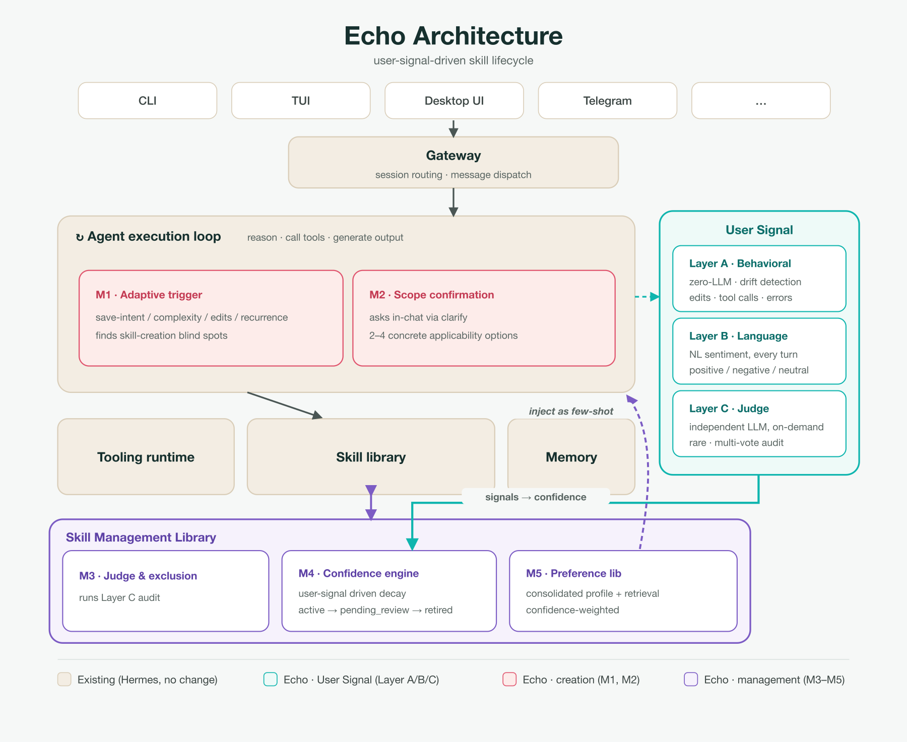

<p align="center">
  
</p>

<h1 align="center">Echo</h1>

<p align="center">
  <b>一个会自我改进的 Agent：它根据你对技能的反应，判断哪些技能是真的好用。</b>
</p>

<p align="center">
  <a href="LICENSE"></a>
  
  <a href="https://github.com/NousResearch/hermes-agent">
  <a href="README.md"></a>
</p>

> 🌐 **English version: [README.md](README.md).**

---

## Echo 是什么？

Echo 是从 [Hermes Agent](https://github.com/NousResearch/hermes-agent) v0.14.0 fork 出来的。
Hermes 本身就具备学习能力：它会从经验中编写技能、复用技能，还能跨会话保留记忆。问题在于这个闭环是自我评分——写技能的模型同时也是评判技能好坏的模型；技能只在 agent 调用工具满 5 次时才会被创建；并且技能一旦生成，就会在所有场景中推荐。Echo 的做法是：不再信任 agent 对自身工作的评价，转而使用用户的真实反馈。

| Hermes 的问题 | Echo 的做法 |
|---|---|
| 写技能的模型，同时也是给它打分的模型。 | 引入一个独立的审计模型，再加上完全不依赖 LLM 的行为漂移检测。两者都从用户侧打分，而非 agent 自评。 |
| 技能仅通过写死的“工具调用满 5 次”规则来创建。 | Echo 还会分析保存意图的措辞、你对输出的修改程度、请求是否重复；且创建前会先询问，而不是静默生成。 |
| 技能一旦生成，就在所有场景被推荐。 | Echo 会询问技能应该用在哪里；审计员可以将其从表现不佳的场景中排除。 |

## 工作原理

<p align="center">
  
</p>

Echo 钩入 agent 主循环，将自己的 `echo_*` 表写入 agent 已有的 SQLite 数据库。它通过三层信号驱动五个模块。

**信号层**
- **Layer A —— 行为信号，无需 LLM。** 为每个技能在线维护基线（Welford 均值/方差），覆盖修改轮次、工具调用次数、工具报错；通过 z-score 检测偏移。
- **Layer B —— 情感。** 每个用户回合都由一个辅助模型分类为正 / 负 / 中性，拿不准时偏向中性。
- **Layer C —— 按需审计。** 当某个技能被标记后，换一个独立模型投票判断它是正常、降级，还是应该从某个场景中排除。

**模块**
- **M1 —— 技能创建触发。** 结合保存意图、复杂度、修改投入度、重复性；创建前先询问。
- **M2 —— 范围确认。** 通过 `clarify` 在对话中询问技能该用在哪里。
- **M3 —— 审计与排除。** Layer C 审计员，并把排除条件注入回 agent。
- **M4 —— 置信度引擎。** 一个衰减状态机：`active → pending_review → retired`。
- **M5 —— 偏好 RAG。** 一份合并的偏好画像，加上按技能置信度加权的示例检索。

## 入口形态

Echo 支持与 Hermes 相同的几种界面，外加一个原生 App：

- **CLI / TUI** —— 带青色 Echo 皮肤的对话界面；信号在后台采集。
- **Web 仪表盘** —— 一个 `/echo` 页面：展示置信度排名、状态分布、技能候选队列、偏好库，以及对话内评分组件。
- **原生 macOS App**（[`desktop/Echo/`](desktop/Echo/)）—— SwiftUI 前端，以子进程方式启动网关，并采集浏览器无法获取的信号（剪贴板、窗口焦点）。

## 快速上手

**前置依赖：** `git` 和 [`uv`](https://docs.astral.sh/uv/)（安装脚本会通过 `uv`
自动装好 Python 3.11，无需系统自带 Python）。支持 macOS / Linux（Termux 亦可）。
原生 macOS 应用额外需要 Xcode Command Line Tools；其余功能不需要它。

**首次安装（一次性）：**

```bash
git clone https://github.com/Prt7-26/Echo.git && cd Echo
./setup-hermes.sh        # 创建 ./venv、装依赖、同步内置技能、跑配置向导
```

`setup-hermes.sh` 会把依赖装进本地 `venv/`，并运行配置向导——先选你的模型 /
供应商，再走 Echo 自己那一步配置可选的审计员模型。这一步同时会启用内置的
`echo_signals` 插件（插件没启用时 Echo 什么都不收集）。之后任何时候都能用
`hermes setup` 重跑向导。

之后所有操作都通过仓库根目录的一个启动器完成：

```bash
./echo chat      # CLI 对话 —— 信号后台采集
./echo tui       # 全屏 TUI
./echo dash      # Web 仪表盘（浏览器打开 /echo）
./echo app       # 原生 macOS App
./echo verify    # 跑测试套件 + 端到端冒烟检查
./echo --help    # 其余形态
```

模型、供应商、API 密钥的配置方式与 Hermes 完全一致 —— 详见 [Hermes 文档](https://hermes-agent.nousresearch.com/docs/)。Echo 只多了一步设置，用于配置可选的审计员模型。

## 仓库结构

仓库中的主要代码复用了 Hermes，Echo 自身的代码主要集中在以下位置：

| 路径 | 内容 |
|---|---|
| [`plugins/echo_signals/`](plugins/echo_signals/) | Echo 主体 —— schema、钩子、信号采集、五个模块 |
| [`tests/plugins/echo_signals/`](tests/plugins/echo_signals/) | 单元测试 |
| [`desktop/Echo/`](desktop/Echo/) | 原生 macOS App |
| [`scripts/eval/`](scripts/eval/) | 评测框架与指标脚本 |
| [`docs/hermes-architecture.html`](docs/hermes-architecture.html) | 理解 Hermes 内部实现的辅助文档 |

Echo 在几处直接修改了 Hermes（网关、Web 和 TUI 前端），因此它是一个独立的 fork —— 无法与上游保持干净的 diff，也没有计划合并回去。其余部分均来自 Hermes，基于其 MIT 许可证一并包含，使本项目能够独立运行。

## 评测

为了避免 agent 自我打分，评测采用了四个相互独立的模型——一个模拟用户、一个独立评分者、一个作为被测 agent，以及 Echo 自己的信号模型。评测对照了两个公开偏好基准（[PersonaMem](https://huggingface.co/datasets/bowen-upenn/PersonaMem) 和 [PrefEval](https://huggingface.co/datasets/siyanzhao/prefeval_explicit)），外加一个模拟用户闭环。我们完整报告了实验方法与数据，包括最初设定的开销目标在哪些方面未达成。

## 致谢与许可证

Echo 源自 [Nous Research](https://nousresearch.com) 的 **[Hermes Agent](https://github.com/NousResearch/hermes-agent)**。整个底座——网关、终端后端、MCP、定时调度，以及 Echo 所依赖的技能 / 记忆系统——都来自该项目。

Echo 由西湖大学 Lingchao Nie、Fanghui Xu、Yuing Zhou 开发。

采用 MIT 许可证 —— 详见 [LICENSE](LICENSE)。版权所有 © 2025 Nous Research；修改及衍生作品 © 2026 Echo 作者。