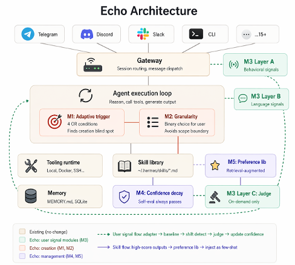

<p align="center">
  
</p>

<h1 align="center">Echo</h1>

<p align="center">
  <b>面向 <a href="https://github.com/NousResearch/hermes-agent">Hermes Agent</a> 的用户信号驱动技能生命周期管理层。</b>
</p>

<p align="center">
  <a href="LICENSE"></a>
  
  <a href="https://github.com/NousResearch/hermes-agent">
  <a href="README.md"></a>
</p>

> 🌐 **English version: [README.md](README.md).**

---

## Echo 是什么?

Hermes Agent 拥有一个**闭环**学习机制:从经验中创建技能、在使用中改进、跨会话持久化知识。
Echo 是一个研究项目,指出了这个闭环中三个有据可查的缺陷,并用一层薄薄的插件来弥补它们——
驱动信号来自**用户的真实行为**,而非 agent 的自我评判。

| Hermes 的缺陷 | Echo 的修复 |
|---|---|
| **同源自评偏差** —— 写技能的模型,同时也是判断它好不好用的模型。 | 引入**独立的 LLM 审计员**(单独配置的模型)+ 零 LLM 行为漂移检测,从**用户侧**为技能打分。 |
| **技能创建触发过窄** —— 只靠写死的"≥5 次工具调用"启发式来孵化技能。 | **自适应触发**:还会响应保存意图、修改投入、重复请求;并且在创建前**主动询问用户**,而不是悄悄生成。 |
| **缺少适用边界** —— 技能一旦生成,就在所有场景被推荐。 | **范围确认** + **排除条件**:Echo 在对话中询问技能应当适用于何处,审计员可把它从表现不佳的场景中隔离出去。 |

Echo **不是**一个以合并回上游为目标的 fork,而是一个长期的二次开发项目:它不改动 Hermes 的
四个核心文件,只通过既有的插件/钩子接口接入,因此"Echo 到底加了什么"的 diff 始终清晰。

## 工作原理

Echo 通过生命周期钩子观察 Hermes,并把自己的 `echo_*` 表写入同一个 SQLite 数据库。
三层信号驱动五个模块:

**信号层**
- **Layer A —— 行为信号(零 LLM)。** 对每个技能在线维护基线(Welford 均值/方差),
  覆盖修改轮次、工具调用次数、工具报错;用 z-score 检验识别漂移。
- **Layer B —— 自然语言情感。** 每个用户回合由辅助模型分类(正/负/中性),提示词保守地偏向 `中性`。
- **Layer C —— 按需审计员。** 当某技能被标记待审时,独立审计员多票表决该技能是
  `ok`、`degraded`(降级)、还是应被`排除`于某场景。

**模块**
- **M1 —— 自适应技能创建触发**(保存意图、复杂度、修改投入、重复性;创建前先问)
- **M2 —— 范围确认**(用 `clarify` 在对话中给出具体的适用范围选项)
- **M3 —— 审计与排除**(Layer C 审计员 + 排除条件注入)
- **M4 —— 置信度引擎**(衰减状态机:`active → pending_review → retired`)
- **M5 —— 偏好 RAG**(合并式偏好画像 + 神经向量示例检索,按置信度加权)

## 入口形态

Echo 覆盖 Hermes 的每一种界面,外加一个原生 App:

- **CLI / TUI** —— 带声呐青(sonar-teal)*Echo* 皮肤的 Hermes 对话;信号在后台采集。
- **Web 仪表盘** —— 一个 `/echo` 插件页:置信度排名、状态分布、候选队列、偏好库,以及对话内评分组件。
- **原生 macOS App**([`desktop/Echo/`](desktop/Echo/))—— SwiftUI Liquid-Glass 前端,以 stdio
  子进程方式拉起网关,并采集浏览器拿不到的系统级信号(剪贴板、窗口焦点)。

## 快速上手

Echo 通过仓库根目录的单一启动器运行:

```bash
./echo chat      # Hermes CLI 对话 —— Echo 在后台采集信号
./echo tui       # 全屏 TUI
./echo dash      # Web 仪表盘(浏览器打开 /echo)
./echo app       # 原生 macOS App(连真实后端)
./echo verify    # 跑 Echo 测试套件 + 端到端冒烟检查
./echo --help    # 查看全部形态
```

底层的 Hermes 安装、模型供应商、API 密钥的配置方式与上游 Hermes 完全一致 ——
参见 [Hermes 文档](https://hermes-agent.nousresearch.com/docs/)。Echo 额外提供一个首次运行的
设置步骤,用于配置可选的独立审计员模型。

## Echo 的代码位置

干净的 `git diff upstream/main` 只会显示这些路径(外加 `.gitignore`、`LICENSE`、`README*`、`CLAUDE.md`):

| 路径 | 内容 |
|---|---|
| [`plugins/echo_signals/`](plugins/echo_signals/) | 插件主体 —— schema、钩子、信号采集、五个模块 |
| [`tests/plugins/echo_signals/`](tests/plugins/echo_signals/) | 单元测试 |
| [`desktop/Echo/`](desktop/Echo/) | 原生 macOS SwiftUI App |
| [`scripts/eval/`](scripts/eval/) | 评测框架 + 指标脚本 |
| [`DevPlan/`](DevPlan/) | 研究提案、schema 规范、设计文档、实验报告 |
| [`docs/hermes-architecture.html`](docs/hermes-architecture.html) | 上手辅助文档 |

代码树里的其余部分都是 **Hermes 上游**,以其 MIT 许可证一并包含,使本项目可独立运行。

## 评测

Echo 采用四模型隔离评测(persona/模拟用户、独立评估器、被测 agent、Echo 自身信号模型各用不同模型)
以避免自评循环,对照公开偏好基准
([PersonaMem](https://huggingface.co/datasets/bowen-upenn/PersonaMem)、
[PrefEval](https://huggingface.co/datasets/siyanzhao/prefeval_explicit))与一个模拟用户闭环。
完整方法、结果,以及对"设计最初的开销目标在哪未达成"的如实说明,见
[`DevPlan/experiment-report-zh.md`](DevPlan/experiment-report-zh.md)(中文)/
[`experiment-report.md`](DevPlan/experiment-report.md)(English)。

## 致谢与许可证

Echo 构建于 [Nous Research](https://nousresearch.com) 的
**[Hermes Agent](https://github.com/NousResearch/hermes-agent)** 之上。Hermes 的全部能力 ——
多平台网关、终端后端、MCP、定时调度,以及 Echo 所扩展的技能/记忆系统 —— 均来自上游项目。

Echo(技能生命周期层及其研究)由西湖大学 Lingchao Nie 及团队开发。

采用 **MIT 许可证** —— 见 [LICENSE](LICENSE)。
版权所有 © 2025 Nous Research;修改及衍生作品 © 2026 Echo 作者。
